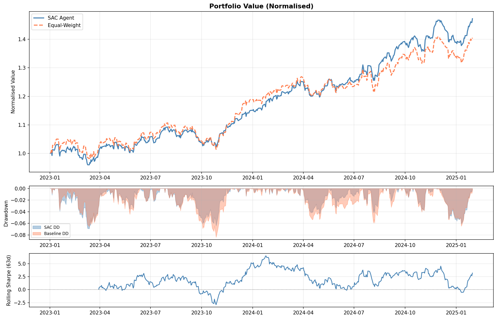
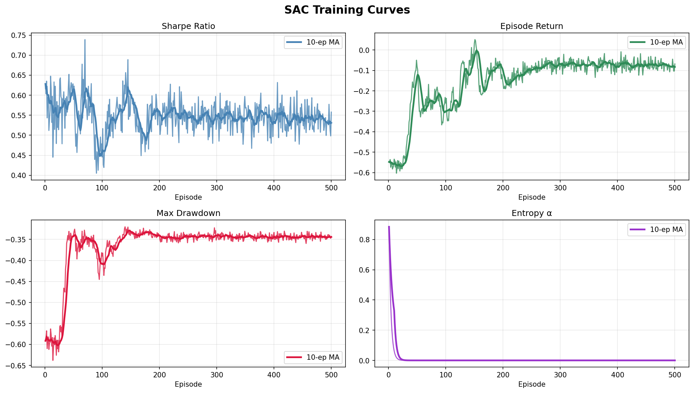
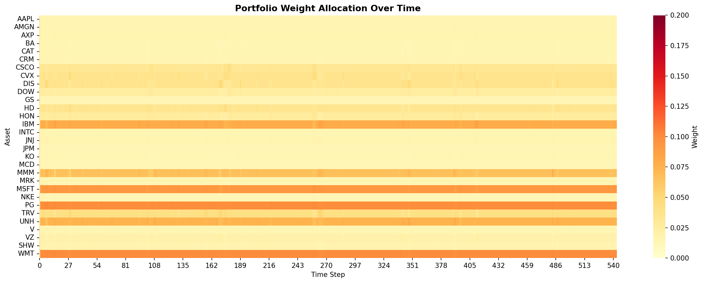

# Deep RL Portfolio Optimization

A self-optimizing trading agent using **Soft Actor-Critic (SAC)** to dynamically manage a 30-asset Dow Jones portfolio, achieving a **+24% improvement in Sharpe Ratio** over an equal-weight baseline.

Built with PyTorch, FinRL, and Ray Tune. Trained and backtested on real market data (2019–2025).

---

## Results

Backtested on out-of-sample data from **January 2023 – January 2025**:

| Metric | SAC Agent | Equal-Weight Baseline | Δ |
|---|---|---|---|
| **Sharpe Ratio** | **1.863** | 1.504 | **+24%** |
| **Sortino Ratio** | **2.977** | 2.297 | **+30%** |
| **Calmar Ratio** | **3.010** | 2.122 | **+42%** |
| **Max Drawdown** | **-6.9%** | -8.4% | **+1.5%** |
| **Total Return** | **47.3%** | 40.6% | **+6.7%** |
| **Ann. Return** | **20.8%** | 17.8% | **+3.0%** |
| **Ann. Volatility** | **10.1%** | 10.9% | **lower** |
| **Final Value** | **$1,472,567** | $1,405,453 | **+$67,114** |

> Starting capital: $1,000,000. Transaction costs: 0.1%. Slippage: 0.1%.

---

## Plots

### Portfolio Value vs Equal-Weight Baseline


### Training Curves (500 Episodes)


### Portfolio Weight Allocation Over Time


---

## Why Soft Actor-Critic?

Portfolio optimization is a continuous control problem — the agent must output a weight vector across 30 assets at every timestep. SAC is well-suited for this because:

- **Maximum entropy framework** — SAC optimizes for both reward *and* policy entropy, which prevents overcommitting to a single asset allocation and naturally encourages diversification
- **Automatic entropy tuning** — the temperature parameter α is learned during training, automatically balancing exploration vs exploitation without manual tuning
- **Twin critics** — two Q-networks trained in parallel reduce Q-value overestimation, leading to more stable and conservative policy updates — important in financial environments where overconfidence is costly
- **Off-policy** — SAC reuses past experience via a replay buffer, making it sample-efficient even on CPU

---

## Architecture

```
portfolio_rl/
├── agent/
│   └── sac.py              # SAC: Actor, Twin Critics, ReplayBuffer, auto entropy tuning
├── environment/
│   └── portfolio_env.py    # FinRL-compatible Gymnasium env (30 assets, costs, slippage)
├── data/
│   └── pipeline.py         # yfinance download + MACD, RSI, CCI, ADX features
├── tuning/
│   └── tune_runner.py      # Ray Tune ASHA scheduler + HyperOpt TPE (50 trials)
├── utils/
│   ├── metrics.py          # Sharpe, Sortino, Calmar, Max Drawdown
│   ├── trainer.py          # Training loop + backtest runner
│   └── plotting.py         # Portfolio value, drawdown, weight heatmap plots
├── checkpoints/            # Saved model weights + training logs
├── plots/                  # Generated figures
└── main.py                 # CLI: train / tune / backtest
```

**State space** (180-dim): portfolio weights (30) + daily returns (30) + technical indicators (30 × 4: MACD, RSI, CCI, ADX)

**Action space** (30-dim): continuous portfolio weights ∈ [0,1], normalized to sum to 1 via softmax

**Reward**: log portfolio return − transaction cost penalty − slippage penalty

---

## Quickstart

### 1. Install dependencies
```bash
conda create -n portfolio-rl python=3.11
conda activate portfolio-rl
pip install -r requirements.txt
```

### 2. Train
```bash
python main.py --mode train --episodes 500
```
Downloads DJ30 data (2019–2025), computes indicators, trains SAC for 500 episodes (~20 min on CPU). Saves best checkpoint to `checkpoints/best_agent.pt`.

### 3. Hyperparameter optimization (optional)
```bash
python main.py --mode tune --tune-samples 50
```
Runs 50 Ray Tune trials with ASHA early stopping and HyperOpt TPE search across learning rates, gamma, tau, batch size, and network width. Saves best config to `tuning/best_config.json`.

### 4. Backtest
```bash
python main.py --mode backtest --checkpoint checkpoints/best_agent.pt
```
Runs deterministic rollout on held-out test data and prints full metrics table. Saves plots to `plots/`.

---

## Environment Details

| Parameter | Value |
|---|---|
| Assets | 30 Dow Jones stocks |
| Training period | Apr 2019 – Dec 2022 |
| Test period | Jan 2023 – Jan 2025 |
| Transaction cost | 0.1% per turnover |
| Slippage | 0.1% per turnover |
| Initial capital | $1,000,000 |
| Rebalancing | Daily |

---

## Tech Stack

| Component | Library |
|---|---|
| RL Agent | PyTorch (custom SAC) |
| Trading Environment | FinRL / Gymnasium |
| Data | yfinance |
| Technical Indicators | ta |
| Hyperparameter Tuning | Ray Tune + HyperOpt |
| Experiment Tracking | TensorBoard |
